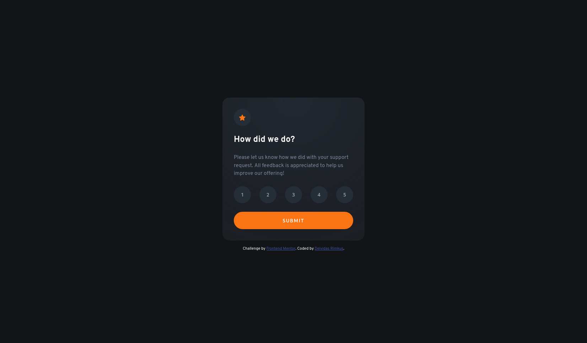

# Frontend Mentor - Interactive rating component solution

This is a solution to the [Interactive rating component challenge on Frontend Mentor](https://www.frontendmentor.io/challenges/interactive-rating-component-koxpeBUmI). Frontend Mentor challenges help you improve your coding skills by building realistic projects.

## Table of contents

- [Overview](#overview)
  - [The challenge](#the-challenge)
  - [Screenshot](#screenshot)
  - [Links](#links)
- [My process](#my-process)
  - [Built with](#built-with)
  - [What I learned](#what-i-learned)
  - [Useful resources](#useful-resources)
- [Author](#author)

## Overview

### The challenge

Users should be able to:

- View the optimal layout for the app depending on their device's screen size
- See hover states for all interactive elements on the page
- Select and submit a number rating
- See the "Thank you" card state after submitting a rating

### Screenshot



### Links

- Solution URL: [GitHub](https://github.com/Lisviks/interactive-rating-component-frontendmentor)
- Live Site URL: [URL](https://lisviks.github.io/interactive-rating-component-frontendmentor/)

## My process

### Built with

- Semantic HTML5 markup
- CSS custom properties
- Flexbox
- Mobile-first workflow

### What I learned

To use and position radial gradient.

```css
.card {
  background: radial-gradient(circle at top, red 0, blue 100%);
}
```

### Useful resources

- [Gradient generator](https://cssgradient.io/)
- [Radial gradient | MDN](https://developer.mozilla.org/en-US/docs/Web/CSS/gradient/radial-gradient)

## Author

- Website - [Deividas Rimkus](https://github.com/Lisviks)
- Frontend Mentor - [@Lisviks](https://www.frontendmentor.io/profile/Lisviks)
- Twitter - [@DRimkusDev](https://www.twitter.com/DRimkusDev)
